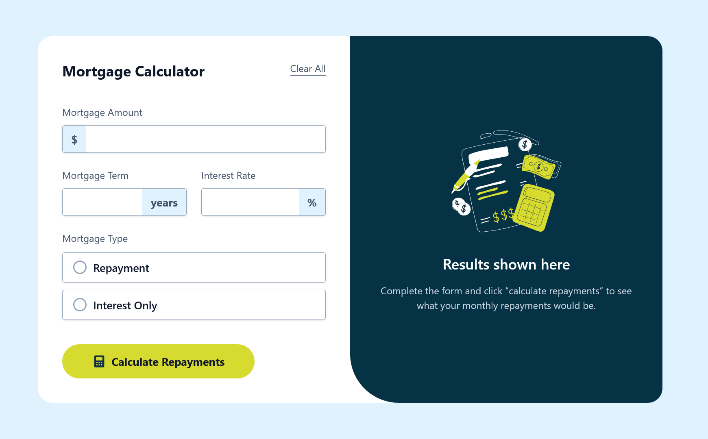
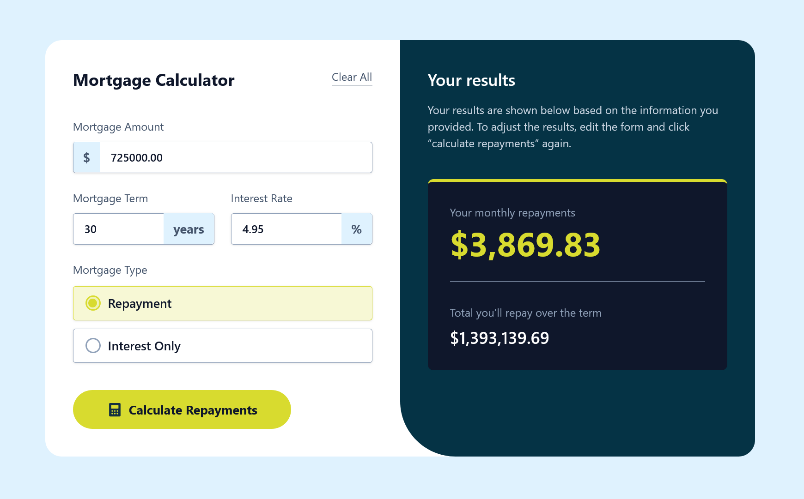
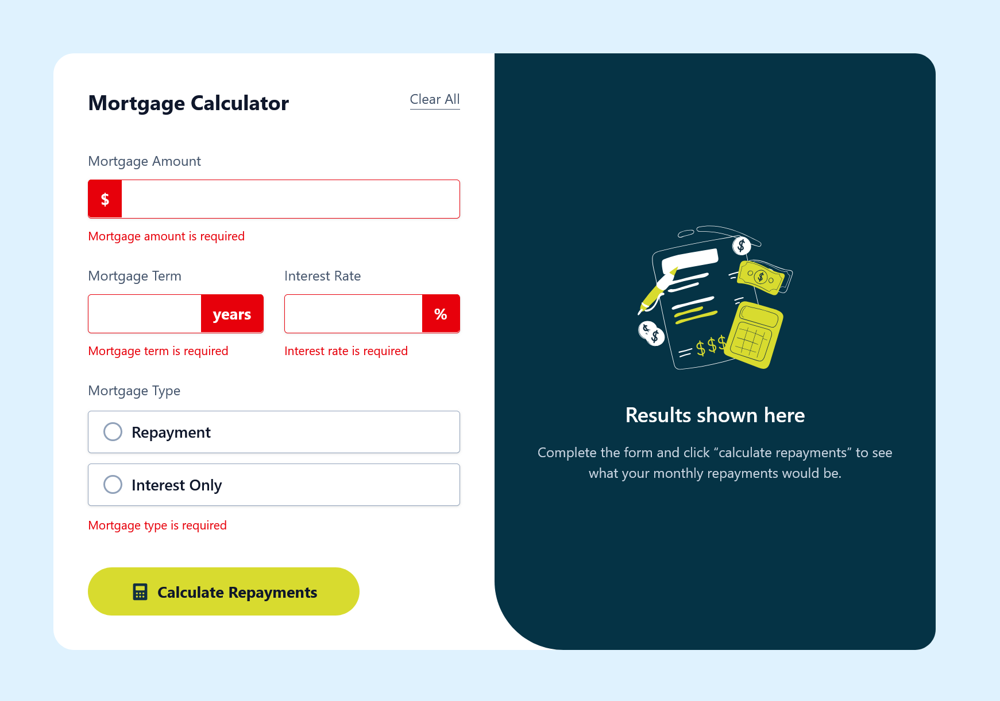

# Mortgage Calculator

A responsive mortgage calculator built with React featuring advanced form validation, accessibility-focused error handling, and cross-browser compatibility.

This is a solution to the [Mortgage repayment calculator challenge on Frontend Mentor](https://www.frontendmentor.io/challenges/mortgage-repayment-calculator-Galx1LXK73). Frontend Mentor challenges help you improve your coding skills by building realistic projects. 

## Table of contents

- [Overview](#overview)
  - [Project requirements](#project-requirements)
  - [Technologies](#technologies)
  - [Screenshot](#screenshot)
  - [Links](#links)
  - [Key learnings](#key-learnings)
- [Technical highlights](#technical-highlights)
  - [Built with](#built-with)
  - [What I learned](#what-i-learned)
  - [Continued development](#continued-development)
  - [Useful resources](#useful-resources)
- [Connect](#connect)


## Overview

### 👥 Project requirements

Users should be able to:

- Input mortgage information and see monthly repayment and total repayment amounts after submitting the form
- See form validation messages if any field is incomplete
- Complete the form only using their keyboard
- View the optimal layout for the interface depending on their device's screen size
- See hover and focus states for all interactive elements on the page

### 🛠️ Technologies

- HTML5
- [React](https://reactjs.org/)
- JavaScript (ES6+)
- [Tailwindcss](https://tailwindcss.com/)
- [Vite](https://vite.dev/)

### 🖥️ Screenshots








### 🚀 Links

- [Frontend Mentor solution page](https://your-solution-url.com)
- [live demo site](https://example-live-demo.app)

### 🎯 Key Learnings

This project demonstrates proficiency in:

- Modern React patterns (hooks, controlled components, forwardRef)
- Form validation and error handling UX
- Cross-browser compatibility problem-solving
- Accessibility implementation (ARIA, focus management)
- Component architecture and code organization
- Pure functions for testable business logic

### 🔧 Technical Highlights

## 📂 Project Structure
```
src/
├── components/
│   ├── MortgageCalculator.jsx  # Main component with state
│   ├── MortgageForm.jsx         # Form container
│   ├── FormInput.jsx            # Reusable input component
│   ├── MortgageTypeSelector.jsx # Radio button group
│   └── ResultsPane.jsx          # Results display
└── utils/
    ├── calculations.js          # Mortgage formulas
    ├── validation.js            # Validation logic
    └── formatters.js            # Currency formatting
```


Use this section to recap over some of your major learnings while working through this project. Writing these out and providing code samples of areas you want to highlight is a great way to reinforce your own knowledge.

To see how you can add code snippets, see below:

```html
<h1>Some HTML code I'm proud of</h1>
```
```css
.proud-of-this-css {
  color: papayawhip;
}
```
```js
const proudOfThisFunc = () => {
  console.log('🎉')
}
```

### Continued development

Use this section to outline areas that you want to continue focusing on in future projects. These could be concepts you're still not completely comfortable with or techniques you found useful that you want to refine and perfect.

Notes:
- Style: I kept within the constraints of base Tailwind colors and fonts, except for the primary lemon-lime green from the design. It's a shortcut, but I was more interested in the React-specific implementation of this project than aiming for pixel perfect matching. I also used this project to zero in on A11Y features and best practices.
- I decided to make the error messaging a little more precise rather than stick with the generic messaging the design comp calls for. Again, looking to make the calculator as accessible as possible.
- Took a slightly more traditional approach to this project. Using pre-React 19 controlled form inputs and opting to pass props down a couple of levels rather than use Context.
- However, I did take advantage of the React 19 update where we no longer need to use forwardRef to forward refs to child components, simplifying that process.
- I went back and forth with the input elements. Originally, I had them as their proper number types and added additional styles to remove the spinners as the design comp calls for. During testing, I was reminded of the Firefox issue that allows for text in numeric inputs. Leaving one generic 'This field is required' error for all issues felt wrong. But since by the time the text values got to React and they were empty strings, my customized error messaging wasn't working properly. I considered a more complex approach to an an extra invalid attribute to the inputs to cover this issue, but it felt too heavyhanded for such a small thing. Ultimately, I opted to go with text inputs with an additional pattern attribute to help achieve the results I was looking for.
- Article noted below... patternMismatch value

### 🔮 Future Enhancements

- [ ] Add amortization schedule visualization
- [ ] Implement mortgage comparison tool
- [ ] Add extra payment calculator
- [ ] Export results as PDF
- [ ] Add unit tests for utility functions

### Useful resources

- [Official Tailwind Docs](https://tailwindcss.com/docs/hover-focus-and-other-states#differentiating-nested-groups) - A love the Tailwind CSS docs. The hover and focus section has some great examples and use cases of dealing with nested and peer group styles. A lot of helpful guidance here to achieve a close match to the design comp.
- [A complete guide to the HTML number input](https://olliewilliams.xyz/blog/guide-to-html-number-input/) - Brilliant and comprehensive article for all things HTML number input. This was a big help in understanding the various attributes of the input and the differences between browsers, and how they handle the settings.
- [Remove spinners Tailwind CSS](https://dev.to/bobbyiliev/how-to-remove-arrow-on-input-type-number-with-tailwind-css-5b0f) - Another good, straightforward article on the necessary Tailwind classes and settings used for updating the default appearance of number inputs.


## 🤝 Connect

- Website - [Matt Pahuta](https://www.mattpahuta.com)
- Frontend Mentor - [@mattpahuta](https://www.frontendmentor.io/profile/MattPahuta)
- Bluesky - [@mattpahuta](https://bsky.app/profile/mattpahuta.bsky.social)
- LinkedIn - [Matt Pahuta](www.linkedin.com/in/mattpahuta)
